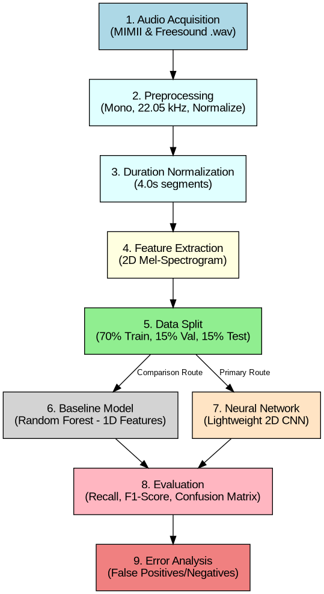

# 1. Problem Definition & Scenario

## Chosen Scenario
**Chosen Option:** Predictive maintenance using machine sounds

## Context of the Problem
In modern manufacturing and industrial facilities, machinery such as motors, pumps, and fans operate continuously. The acoustic profile of these machines is highly indicative of their mechanical health. By monitoring these sounds, we can detect anomalies before they lead to catastrophic mechanical failures. 

## Why the Classification Task is Relevant
Unplanned downtime in industrial settings costs millions of dollars annually. Traditional maintenance is either reactive (fixing after breaking) or preventive (fixing based on a schedule, which can be unnecessary). Acoustic predictive maintenance allows for condition-based monitoring, detecting early signs of wear (like friction or impacts) safely and non-invasively, saving money and preventing accidents.

# 2. Description of the Acoustic Classes

The system will classify short audio segments into one of the following **eight classes**, representing healthy and faulty states of four key industrial machines:

1. **Fan Normal:** Smooth, continuous hum of a healthy industrial cooling fan.
2. **Fan Anomaly:** Squeaking or rattling indicating bearing friction or physical damage.
3. **Pump Normal:** Healthy vibration and continuous flow sounds.
4. **Pump Anomaly:** Cavitation, clogging, or grinding pump sounds.
5. **Valve Normal:** Clean, repetitive opening and closing clicking sounds.
6. **Valve Anomaly:** Gas/liquid leakage hiss, or irregular clicking due to contamination.
7. **Slider Normal:** Regular, smooth sliding rails moving back and forth.
8. **Slider Anomaly:** Scraping, scratching, or uneven sliding due to rails wear or misalignment.

**Possible Challenges:**
- High Background Noise reducing the Signal-to-Noise Ratio (SNR) (MIMII mixes background noise at up to -6 dB).
- Class Similarity making certain mechanical faults hard to distinguish (e.g. pump grinding vs slide scraping).
- Data Imbalance (fault data is rare compared to normal operation data).

# 3. Dataset Proposal

## Dataset Strategy
**Chosen Option:** We selected the option to **Use a public dataset** (specifically, the DCASE 2020 Challenge Task 2 Development Dataset, which contains a curated subset of the MIMII industrial machine recordings).

This dataset contains real-world recordings of fans, pumps, valves, and slide rails operating in both healthy (normal) and anomalous (faulty) states, mixed with real factory background noises at different volume levels.

## Dataset Details
- **Source of the data:** 
  * Zenodo Repository Page: [https://zenodo.org/record/3678171](https://zenodo.org/record/3678171) (DOI: 10.5281/zenodo.3678171)
  * Files to Download: `dev_data_fan.zip` (1.4 GB), `dev_data_pump.zip` (1.0 GB), `dev_data_valve.zip` (1.1 GB), `dev_data_slider.zip` (1.1 GB). Total size is approximately **4.6 GB**.
- **Number of classes:** 8 (Fan Normal, Fan Anomaly, Pump Normal, Pump Anomaly, Valve Normal, Valve Anomaly, Slider Normal, Slider Anomaly).
- **Expected number of audio samples per class:** Over 1,000 samples for normal classes, and 200–400 for anomalous classes.
- **Approximate duration of each audio sample:** Standardized to **4 seconds** per sample (sliced from the raw 10-second clips to increase sample count and reduce memory footprint).
- **File format:** `.wav` (Waveform Audio File Format, 16-bit, mono).
- **Sampling rate:** Resampled to a standardized **22,050 Hz (22.05 kHz)**.
- **Dataset Balance:** **Unbalanced**. Normal operation samples are significantly more abundant than anomaly samples. Data augmentation and weighted loss functions will be used.

# 4. Audio Representation Comparison

To use 2D-CNNs, we must transform the 1D audio signal into a 2D image-like representation. 

1. **Raw Waveform:** Captures instantaneous amplitude. Preserves time but frequency is difficult to extract without deep feature learning. Not suitable for standard 2D-CNNs (requires 1D-CNNs). Highly sensitive to noise.
2. **MFCCs (Mel-Frequency Cepstral Coefficients):** Captures timbre and spectral envelope shape. Forms a 2D matrix suitable for CNNs. Extremely low dimensionality, but it is a lossy compression that discards fine-grained spectral details crucial for mechanical sounds.
3. **Mel-spectrogram:** Captures the energy of different frequency bands over time mapped to the Mel scale. **Highly suitable for a 2D-CNN**, functioning like a 1-channel (grayscale) image. Retains critical spectral details.

# 5. Selected Representation and Justification

The project will use the **Mel-spectrogram** as the primary audio representation. 

**Justification:** The Mel-spectrogram converts our 1D acoustic signal into a rich 2D time-frequency image. Industrial anomalies, such as bearing faults (high-frequency energy spikes) or imbalances (low-frequency periodic pulses), are visually distinct in a spectrogram. By using this representation, we can leverage powerful 2D Convolutional Neural Networks (CNNs) to detect these acoustic patterns efficiently.

**Parameter Baseline and Flexibility:**
Our initial feature extraction will use a standard configuration: `n_fft = 2048` (window size), `hop_length = 512` (stride), and `n_mels = 128` (frequency bands), producing a `128 x 173` input grid. Because of the fundamental time-frequency trade-off (Gabor's Limit), these parameters are not locked in. If early testing shows the model struggles to detect rapid metallic impacts (which require higher time resolution/smaller hop and window sizes) or constant motor hums (which benefit from higher frequency resolution), we will experimentally tune these parameters during the development phase.

# 6. Complete Machine Learning Pipeline

1. **Audio Acquisition:** Download the 4 machine zip files (`dev_data_fan.zip`, `dev_data_pump.zip`, `dev_data_valve.zip`, `dev_data_slider.zip`) from the DCASE 2020 Task 2 dataset on Zenodo.
2. **Preprocessing:** Convert to mono and resample to 22,050 Hz. Normalize amplitude.
3. **Duration Normalization:** Ensure every audio clip is exactly 4.0 seconds long (zero-pad or truncate).
4. **Feature Extraction:** Transform 1D audio into 2D Mel-spectrograms.
5. **Train / Validation / Test Split:** Restructure the unsupervised DCASE `train` and `test` folders into 8 clean supervised class directories, then divide the data (70% Train, 15% Validation, 15% Test) using stratified sampling.
6. **Baseline Model:** Train a simple classifier (Random Forest) to establish a minimum performance threshold.
7. **CNN Model Training:** Train a 2D Convolutional Neural Network on the Mel-spectrograms.
8. **Evaluation:** Test the CNN on the Test Split calculating Precision, Recall, F1-Score, and plotting a Confusion Matrix.
9. **Error Analysis:** Analyze False Positives and False Negatives to understand blind spots.

# 7. Baseline Model Proposal

We will use a **Random Forest Classifier** as our baseline model.

- **Input Features:** Flattened, globally averaged Mel-spectrograms (mean and standard deviation across the time axis), resulting in a 1D vector.
- **Why it is a Reasonable Comparison:** Random Forests are fast, robust, and resist overfitting on 1D data. Since it takes averaged features, it ignores spatial/temporal relationships. If our CNN significantly outperforms it, it proves that structural patterns (like rhythms) are crucial.
- **Expected Results:** Decent performance on vastly different classes (~60-70% accuracy), but poor at distinguishing similar mechanical states due to the destruction of rhythmic temporal data.

# 8. CNN Architecture Proposal

We propose a lightweight, custom 2D CNN architecture.

- **Architecture Flow:** Input -> Conv2D+ReLU -> MaxPooling2D -> Conv2D+ReLU -> MaxPooling2D -> Flatten -> Dense+ReLU -> Dropout -> Dense(Output)+Softmax.
- **Input Shape:** `(128, 173, 1)`.
  * **128 (Height):** Mel frequency bands.
  * **173 (Width):** Time frames. Calculated from our audio parameters: a 4.0-second clip at 22,050 Hz contains 88,200 samples. Slicing with a `hop_length` of 512 samples yields $\approx 173$ time steps (including standard boundary padding).
  * **1 (Channel):** Single channel (grayscale).
- **Output Classes / Activation:** 8 classes / `Softmax` (outputting a probability distribution across the 8 mutually exclusive classes).
- **Loss Function / Optimizer:** `Categorical Crossentropy` / `Adam`.
- **Why a CNN is Appropriate:** CNNs use local receptive fields to detect structural patterns (edges, textures) in the Mel-spectrogram, regardless of exactly *when* they occur in the 4-second window (translation invariance).

**Hardware Optimization and Architectural Iteration:**
Because the training will be executed on a dedicated RTX GPU, the model training time will be highly optimized (expected to take under 2–3 minutes for 30–50 epochs on our relatively small dataset). This hardware advantage allows the team to treat the proposed CNN architecture as a flexible baseline. If initial validation results are unsatisfactory, we will leverage fast retraining cycles to experimentally tune hyperparameters:
- Increasing/decreasing filter sizes (e.g., 32 to 64) and adding layers.
- Adjusting dropout rates (e.g., 0.25 to 0.5) to manage overfitting.
- Experimenting with learning rates and batch sizes to stabilize convergence.

# 9. Validation Strategy

- **Data Splitting:** 70% Training, 15% Validation, 15% Testing.
- **Why Accuracy is Insufficient:** In predictive maintenance, data is highly unbalanced (e.g., 90% normal, 10% fault). A model always guessing "Normal" gets 90% accuracy but is useless.
- **Primary Metrics:** We will rely on **Recall** (finding all actual faults is critical to prevent breakdowns), **Precision**, and the **Macro F1-Score**.
- **Confusion Matrix:** To visualize exactly where the model makes mistakes between similar classes.
- **Training and Validation Curves:** To monitor Loss and Accuracy and prevent overfitting (memorization).
- **Error Analysis:** Isolating misclassified clips to identify dataset or model weaknesses.

# 10. AI Use Log and Critical Reflection

*Note: The AI Use Log of the most significant prompts and the respective responses is provided as a separate appendix document (Conversation_Log.pdf) due to its length.*

We will use the questions provided in the instructions as a guide to assess our AI use and its performance in this use case.

**Did the AI suggest an architecture that was too complex for the dataset?**
> While the architecture it proposed wasn't the simplest one we know, like a simple multilayer perceptron, we think that the complexity of the proposed CNN is adequate for the complexity of the task. We think that analyzing the source of a sound is quite complex for a simple approach, and it is also simple enough to run on our available hardware while being sophisticated enough to correctly classify the different classes of our dataset.

**Did the AI confuse MFCCs with spectrogram images?**
> No, it clearly explained both and their differences, the advantages and disadvantages of each one and at the end it explained why we should use the mel-spectrogram, which is a variant of the spectrogram.

**Did the AI suggest an evaluation metric that was insufficient?**
> Yes, it initially suggested accuracy, but we realized and it came to the conclusion on its own about the fact that we shouldn't use accuracy alone, it wouldn't be sufficient or a good metric on its own because the dataset is unbalanced. So if we evaluate the model based on pure accuracy, it could say everything is working correctly, and since most of the dataset is about correctly functioning machines, that metric would be in theory great but it's actually misleading. 

**Did the AI produce code or explanations that required correction?**
> At first, we couldn't identify anything that needed correction, but as we dove deeper, we had to correct a few critical things in its proposed plan. For example, we noticed that the DCASE dataset was pre-split for unsupervised anomaly detection (with normal and anomaly data separated into train/test folders), so we had to correct the AI's training pipeline to include a directory merging and restructuring step before splitting. We also realized we needed to be flexible with the Fourier parameters for producing the Mel-spectrogram instead of using fixed values, to adjust for the time-frequency resolution trade-off (Gabor's Limit) depending on the machine sounds. Aside from that, we had to ask it to expand on certain topics and explanations to be more detailed. We think we know just enough from our basic knowledge in signal analysis and Machine Learning to identify when something is incorrect. 

**What did your team learn by validating the AI-generated information?**
> That most of the time it is a really reliable tool that can accelerate learning and productivity at the same time if used correctly. Once you know its limitations and are aware of where it can fail, it becomes in our opinion a sort of search engine that tailors your search to your exact need and level of knowledge. 
> 
> We believe that the best way to use it to both learn and create useful things is to discuss with the AI in a tight and dynamic feedback loop where you can steer it to exactly what you visualize while you learn about the requirements and implications of whatever you want to do. 
> 
> In comparison to other teams that expected the multiple AI agents to produce this whole part of the project, we think doing it part by part is better because when you expect it to do it all, you have to wait for the whole output, the AI will decide unilaterally the details and at the end you will have to make a lot of corrections and modifications for it to be to our liking, plus you learn slower because it doesn't explain every step. At the end it isn't unlikely that abusing AI will end up causing a slower development and debugging.

# 11. References

- Koizumi, Y., Kawaguchi, Y., Imoto, K., Nakamura, T., Nikaido, Y., Tanabe, R., ... & Suefusa, K. (2020). *Description and Discussion on DCASE 2020 Challenge Task 2: Unsupervised Detection of Anomalous Sounds for Machine Condition Monitoring*. arXiv preprint arXiv:2006.05822. DOI: 10.5281/zenodo.3678171. Available at: [https://zenodo.org/record/3678171](https://zenodo.org/record/3678171)
- Purohit, H., Tanabe, R., Ichige, K., Endo, T., Nikaido, Y., Suefusa, K., & Kawaguchi, Y. (2019). *MIMII Dataset: Sound Dataset for Malfunctioning Industrial Machine Investigation and Inspection*. Zenodo. DOI: 10.5281/zenodo.3384388. Available at: [https://zenodo.org/record/3384388](https://zenodo.org/record/3384388)
- Font, F., Roma, G., & Serra, X. (2013). *Freesound technical demo*. In Proceedings of the 21st ACM international conference on Multimedia (pp. 997-998). Available at: [https://freesound.org](https://freesound.org)

