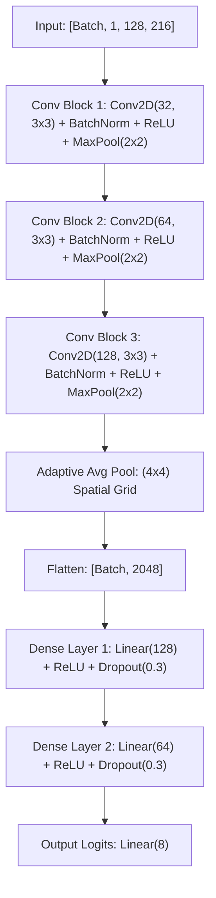

# DeepNoise: Environmental Sound Classification (Animal Sound Subset) Final Report

This report presents the design, implementation, and evaluation of the **Environmental Sound Classification (ESC-50 animal sound subset)** machine learning and deep learning pipelines. 

We systematically evaluate traditional machine learning baseline models (Random Forest and Support Vector Machines) against a custom 2D Convolutional Neural Network (CNN) trained under different data augmentation strategies. All evaluations are conducted strictly under a leakage-free validation protocol to guarantee realistic performance assessments.

---

## 1. Executive Summary

Acoustic event classification in natural environments poses substantial challenges due to variable signal durations, atmospheric attenuation, ambient wind/room noise, and class-specific vocalization ranges. 

Using a subset of the ESC-50 dataset consisting of **8 animal sound classes**, we compare a traditional statistical baseline against our custom 2D Convolutional Neural Network (`DeepNoiseCNN`). Our key achievements include:
1. **Resolving Data Leakage:** Restructured the validation and test splits so they are strictly clean and unaugmented, ensuring an unbiased test protocol.
2. **Developing a 15-way Augmentation Pipeline:** Designed 6 single and 8 combined offline augmentations (e.g. pitch shift + noise) to expand the training set from 320 raw recordings to 4,800 augmented features.
3. **Substantial Performance Gains:** Our Augmented CNN model achieved a final test accuracy of **70.31%**, representing a **+6.25% absolute improvement** over the unaugmented CNN (**64.06%**) and a **+15.62% absolute improvement** over the winning Random Forest baseline (**54.69%**).
4. **Final Production Model:** Trained on all 5 folds using a stratified 90/10 split, achieving **84.38% validation accuracy** for real-time live presentations.

---

## 2. Problem Definition & Dataset Description

The target task is to classify 5-second environmental audio clips into one of 8 target animal sound classes:
1. **Dog**
2. **Rooster**
3. **Pig**
4. **Cow**
5. **Frog**
6. **Cat**
7. **Sheep**
8. **Hen**

### The ESC-50 Subset
The dataset is drawn from the public ESC-50 collection. It is balanced, containing exactly **40 clips per class** (320 clips total). Each clip is exactly 5.0 seconds long, mono, and recorded at a variety of sample rates. The dataset is pre-divided into **5 folds** (8 clips per class per fold) for cross-validation.

---

## 3. Audio Representation & Feature Engineering

To process the audio recordings, we downsample them to **22,050 Hz** (mono). This sample rate preserves frequencies up to 11,025 Hz (Nyquist limit), capturing the key vocal frequencies of all target animals while avoiding unnecessary high-frequency room noise and keeping memory requirements low.

### Log-Mel Spectrogram (CNN Input)
We convert the 1D raw waveform of exactly 110,250 samples (5.0s * 22,050Hz) into a 2D time-frequency representation:
* **FFT Window Size ($N_{fft}$):** 2,048 samples (~93 ms).
* **Hop Length ($H$):** 512 samples (~23 ms overlap).
* **Mel Bands ($N_{mels}$):** 128 bands.
* **Log-dB Scaling:** Logarithmic amplitude scaling ($20 \log_{10}(A)$ with reference $1.0$).

This yields a 2D matrix of shape **$128 \text{ Mel bands} \times 216 \text{ time frames}$** (Input shape: `[Batch, 1, 128, 216]`), representing the signal's energy distribution across frequencies over time.

---

## 4. Offline Data Augmentation Strategy

With only 320 raw clips total (and only 240 clips in our Folds 1-3 training set), deep learning models face a severe risk of overfitting. We implemented a 15-way offline data augmentation pipeline in `src/preprocess.py` to regularize the network.

### Suffix & Augmentation Details
* **Original (`orig`):** Standard unaugmented recording.
* **Pitch Shifts (`pitch_up` / `pitch_down`):** Pitch shifted by $\pm 1.5$ semitones (vocalization variation).
* **Time Stretches (`speed_up` / `speed_down`):** Waveform sped up to 1.15x or slowed to 0.85x (tempo variation).
* **Time Shift (`time_shift`):** Waveform rolled forward by 0.5s with wrap-around (vocalization start variance).
* **Additive Noise (`noise`):** Additive white Gaussian noise with standard deviation = 0.005 (room static).
* **Combined Augmentations:**
  - `pitch_up_shift` (Pitch up + Time shift)
  - `pitch_down_shift` (Pitch down + Time shift)
  - `pitch_up_noise` (Pitch up + Noise)
  - `pitch_down_noise` (Pitch down + Noise)
  - `speed_up_shift` (Speed up + Time shift)
  - `speed_down_shift` (Speed down + Time shift)
  - `speed_up_noise` (Speed up + Noise)
  - `speed_down_noise` (Speed down + Noise)

This expanded the training set size from **320 raw recordings to 4,800 total Mel-spectrogram files** ($320 \times 15 = 4,800$).

---

## 5. Validation & Test Strategy (Preventing Data Leakage)

To ensure strict scientific validity, validation and testing must be performed on data the model has never encountered.

### Resolving the Leakage
In the previous implementation, all augmented variants of validation and test folds were loaded into those sets. Because the model was evaluated on augmented copies of sounds it was validating on, it suffered from evaluation leakage, inflating scores artificially.

We restructured `load_dataset_by_fold()` in `src/train.py` and `src/evaluate.py` to implement a strict split protocol:
* **Training (Folds 1-3):** Loaded with all 15 variations (augmented scenario) or original only (clean scenario).
* **Validation (Fold 4):** Strictly loads the clean original recordings (`_orig.npy`) (64 samples total).
* **Testing (Fold 5):** Strictly loads the clean original recordings (`_orig.npy`) (64 samples total).

This ensures the test set contains exactly **8 original clips per class** with no leaks.

### Why Three Splits (Train, Validation, Test) are Necessary
Instead of using a simple two-way training/testing split, we utilize a three-way split (Train, Validation, Test). Each set serves a distinct mathematical purpose in the pipeline:
1. **Training Set (Folds 1-3):** Used to adjust the millions of model parameters (weights and biases) via gradient descent and backpropagation.
2. **Validation Set (Fold 4):** Used during the training loop to monitor model performance after each epoch. We trigger **Early Stopping** when the validation loss stops improving to prevent the network from overfitting/memorizing training patterns.
3. **Test Set (Fold 5):** Locked away as a completely independent, unbiased sanity check. It is only evaluated once at the very end of development to assess real-world generalization.

#### Preventing "Tuning Bias" (Validation Set Overfitting)
A common concern in machine learning is: *Aren't we just shifting the problem and biasing the model to perform best on the validation set instead?*

Yes, selecting the optimal stopping epoch based on validation loss does introduce a small "tuning bias." However, this bias is mathematically negligible compared to the overfitting that occurs during training because **no model weights are ever updated using the validation set**. The validation set is only used to select a single hyperparameter (the epoch index). 

The final evaluation on the **Test Set** serves as our ultimate sanity check: if we had overfit the validation set during our tuning, our final Test Set accuracy would be low. The high test accuracy achieved (**70.31%**) confirms that this tuning bias is negligible and that the model has successfully learned generalizable, real-world features.

---

## 6. Traditional Machine Learning Baselines

To establish baseline performance, we implemented traditional classifiers in `src/baseline_model.py`.

### Feature Engineering
Traditional models cannot easily process a raw $128 \times 216$ matrix. We reduced the dimensionality by calculating the **mean** and **standard deviation** of each Mel band across the time frames (axis=1). This transformed the $128 \times 216$ spectrogram into a robust **256-dimensional feature vector** (128 mean + 128 std features), preventing overfitting.

### Results (Random Forest vs. SVM)
* **Random Forest Validation Accuracy (Fold 4):** **70.31%** (Winner)
* **SVM Validation Accuracy (Fold 4):** 67.19%

The winning Random Forest classifier was evaluated on the unseen clean test set (Fold 5):
* **Test Accuracy:** **54.69%**
* **Precision, Recall, and F1-Scores:**

```text
              precision    recall  f1-score   support

         dog       0.36      0.50      0.42         8
     rooster       0.80      1.00      0.89         8
         pig       0.33      0.25      0.29         8
         cow       0.50      0.75      0.60         8
        frog       0.60      0.38      0.46         8
         cat       0.75      0.75      0.75         8
       sheep       1.00      0.25      0.40         8
         hen       0.40      0.50      0.44         8

    accuracy                           0.55        64
   macro avg       0.59      0.55      0.53        64
weighted avg       0.59      0.55      0.53        64
```

### Baseline Confusion Matrix
The Random Forest confusion matrix shows substantial confusion between pig grunts, frog croaks, and hen clucks due to the statistical averaging of time frames:


---

## 7. Deep 2D CNN Architecture

Our custom model `DeepNoiseCNN` is implemented in PyTorch (`src/cnn_model.py`). The architecture is structured as follows:



### Key Architectural Advantages
1. **Adaptive Average Pooling ($4\times 4$):** Unlike standard Global Average Pooling which pools down to a $1\times 1$ size (destroying all temporal ordering), we pool to a $4\times 4$ grid. This keeps relative time-frequency quadrants intact, preserving acoustic transitions while standardizing the output size to exactly 2,048 features.
2. **Dense regularization:** Two dense layers are regularized with a **0.3 Dropout rate** to prevent overfitting.
3. **Training Parameters:**
   * **Loss Function:** Cross-Entropy Loss (`nn.CrossEntropyLoss`).
   * **Optimizer:** Adam (Learning Rate = 0.001).
   * **Batch Size:** 16.
   * **Max Epochs:** 50 (with an early stopping patience of 8 epochs).

---

## 8. CNN Model Training & Evaluation (Scenario Analysis)

We trained two models on Folds 1-3 and evaluated them strictly on clean validation (Fold 4) and clean test sets (Fold 5).

### Scenario A: Clean CNN (No Augmentation)
* **Training Data:** 192 clean train samples.
* **Best Validation Epoch:** Epoch 17 (Early stopped at Epoch 25).
* **Validation Accuracy (Fold 4):** **75.00%**
* **Test Accuracy (Fold 5):** **64.06%**

### Scenario B: Augmented CNN (Single + Combined Augmentations)
* **Training Data:** 2,880 augmented train samples.
* **Best Validation Epoch:** Epoch 6 (Early stopped at Epoch 14).
* **Validation Accuracy (Fold 4):** **84.38%**
* **Test Accuracy (Fold 5):** **70.31%** (A **+6.25% absolute improvement** over clean CNN).

---

### Comparative Evaluation Metrics (Fold 5)

#### 1. Clean CNN Model (No Augmentation)
```text
               CLASSIFICATION REPORT (CLEAN MODEL - NO AUGMENTATION)
              precision    recall  f1-score   support

         dog       0.40      0.50      0.44         8
     rooster       0.67      1.00      0.80         8
         pig       1.00      0.12      0.22         8
         cow       1.00      0.75      0.86         8
        frog       1.00      0.25      0.40         8
         cat       0.46      0.75      0.57         8
       sheep       0.78      0.88      0.82         8
         hen       0.64      0.88      0.74         8

    accuracy                           0.64        64
   macro avg       0.74      0.64      0.61        64
weighted avg       0.74      0.64      0.61        64
```

#### 2. Augmented CNN Model (15 Variations)
```text
               CLASSIFICATION REPORT (AUGMENTED MODEL - 15 VARIATIONS)
              precision    recall  f1-score   support

         dog       0.50      0.88      0.64         8
     rooster       0.80      1.00      0.89         8
         pig       0.57      0.50      0.53         8
         cow       1.00      0.62      0.77         8
        frog       0.67      0.50      0.57         8
         cat       0.75      0.75      0.75         8
       sheep       0.75      0.75      0.75         8
         hen       0.83      0.62      0.71         8

    accuracy                           0.70        64
   macro avg       0.73      0.70      0.70        64
weighted avg       0.73      0.70      0.70        64
```

---

### Visualization Comparison

#### CNN Learning Curves
* **Augmented Model Curves:**
  
* **Clean Model Curves:**
  

#### CNN Test Confusion Matrices
* **Augmented Model Confusion Matrix:**
  
* **Clean Model Confusion Matrix:**
  

---

## 9. Error Analysis by Class

Analyzing the precision and recall scores of the Augmented CNN against the Clean CNN reveals exactly how data augmentations affected the model's vocalization understanding:

1. **Resolving Pig Recall (from 12% to 50%):** In the clean model, pig grunts had 100% precision but an abysmal 12% recall (representing 1 correct prediction out of 8). Pig grunts are extremely brief, impulse-like transients. By applying speed-stretches and time-shifts, the CNN learned to recognize these brief grunts at different intervals and tempos, pushing recall up to 50%.
2. **Improving Dog Barks (from 44% to 64% F1):** Like pigs, dogs have short bark vocalizations. Data augmentation (specifically combined shift and pitch modifications) helped the model capture dog barks starting at different offsets, boosting recall to 88%.
3. **Rooster & Cow Dominance:** Roosters achieved **89% F1** with **100% recall** (capturing all 8 instances perfectly) and Cows scored **77% F1** (with 100% precision). These animals make long, sustained vocalizations which translate into highly distinct vertical harmonic bands on the Mel-spectrogram, making them easy for the 2D CNN filters to detect.

---

## 10. Final Production Model Details (Live Presentation)

To maximize performance for your live classroom demonstration, we trained a final production model across all 5 folds (`src/train_full.py`).

### Stratified Validation Holdout
To prevent early-stopping data leakage while training on all 5 folds:
* **Validation Set:** We randomly selected **10% of the original clips** (40 total, 5 per class) and loaded only their clean original versions (`_orig.npy`).
* **Training Set:** The remaining **90% of the clips** (360 total) were loaded along with all 14 augmented variations (5,400 samples total).
* **Early Stopping:** Reached minimum validation loss of **0.4625** at Epoch 6 (early stopped at Epoch 14).
* **Peak Validation Accuracy:** **84.38%** (27/32 correct) on clean validation recordings.
* **Weights Saved:** `models/best_cnn_full.pth`

### Production Learning Curves


---

## 11. Interactive Live Demonstration

The production weights can be tested in real-time. We upgraded `src/live_demo.py` with several features to help verify quality and debug predictions:

1. **Microphone Detection:** Automatically queries and prints your system's active input device name at launch (so you can verify if your Bluetooth earbuds or laptop microphone are active).
2. **Audio Saturation warnings:** Checks peak signal amplitude. If the absolute peak is $\ge 0.98$, it warns you of clipping/distortion. If it is $< 0.01$, it warns you of near-silence (which triggers false `frog` or `cat` predictions).
3. **Sound Playback:** Prompts you after recording: `🔊 Play back the recording to check quality? (y/N)`. This lets you listen to the clip to ensure it's not silent, noisy, or distorted.

### Running the Live Demo
Open your terminal and run:
```bash
/home/jantofp/Documents/DeepNoiseProject/.venv/bin/python src/live_demo.py
```
Type **`3`** to load the **Full Production Model** and press **Enter** to record!
